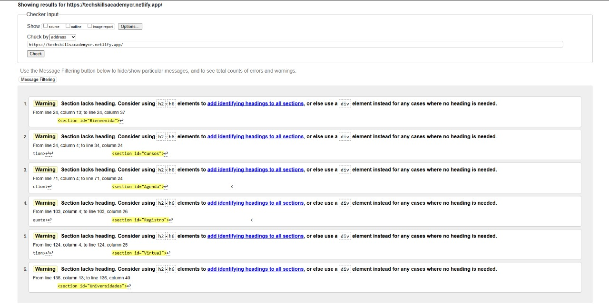
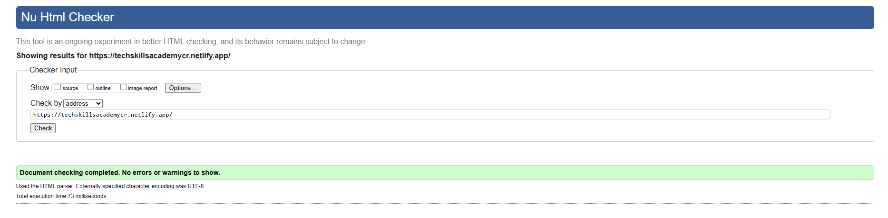
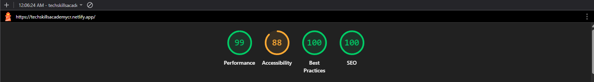
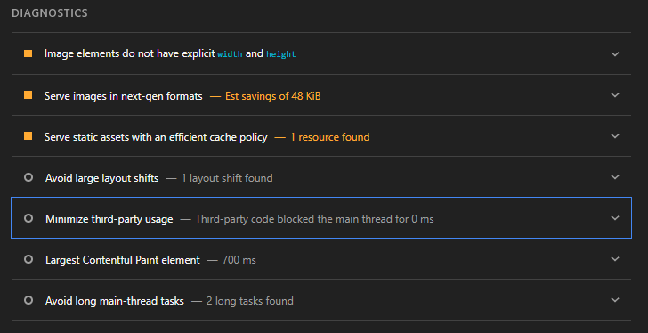
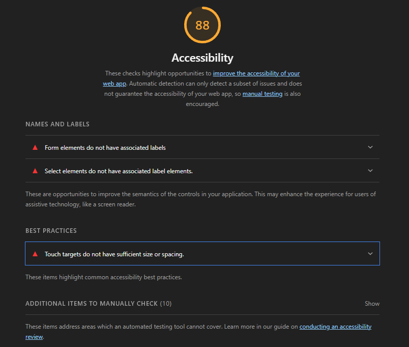
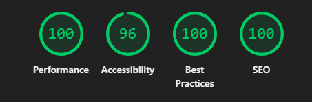

# Tech Skills Academy 2025
💻 *Laboratorio 2*  
**Nombre:** Brasly Villarebia Morales  
**Carné:** 2023105915  
**Curso:** IC-8057 – Introducción al Desarrollo de Páginas Web

---

## Descripción de la página
Este sitio web ofrece matrícula de cursos en áreas de alta demanda, tales como:

- **Ciberseguridad**  
- **Análisis de datos**  
- **Redes**  

### Proporciona:
- Agenda de cursos  
- Formulario breve para inscripción  
- Información sobre la modalidad de los cursos y la plataforma o lugar donde se impartirán las clases

---

## Estructura semántica
- **`<header>`**: Encabezado principal con el título del sitio.  
- **`<nav>`**: Barra de navegación con enlaces internos a secciones.  
- **`<main>`**: Contenido principal de la página.  
- **`<article>`**: Describe los cursos disponibles.  
- **`<figure>`** + **`<figcaption>`**: Utilizados para la inclusión de imágenes de los cursos.  
- **`<form>`**, **`<label>`**, **`<input>`**, **`<select>`**, **`<option>`**, **`<button>`**: Utilizados para la creación del formulario de inscripción.  
- **`<table>`**, **`<thead>`**, **`<tbody>`**, **`<tr>`**, **`<th>`**, **`<td>`**: Creación de tabla sobre la disponibilidad de horarios por curso.  
- **`<blockquote>`**: Cita destacada del evento.  
- **`<aside>`**: Información lateral sobre profesores y contactos.  
- **`<footer>`**: Pie de página con derechos de autor.  

---

## URL pública de Netlify
[https://techskillsacademycr.netlify.app/](https://techskillsacademycr.netlify.app/)

---

## Validación W3C

### Prueba #1
  

En la primera prueba de W3C se muestran 5 warnings, los cuales se deben a no respetar la estructura de encabezados h2-h6. La página sugiere que, si no son indispensables, se utilice la etiqueta `<div>`.

### Prueba #2
Se corrigen los encabezados agregando la etiqueta `<h2>`, respetando así la jerarquía de títulos en la página web. Con estas modificaciones, en la segunda prueba de W3C no se muestran warnings.



---

## Lighthouse

Mediante la herramienta Lighthouse se evaluarán 4 categorías:

- Performance  
- Accessibility  
- SEO  
- Best practices

### Prueba #1


#### Prueba SEO y Best practices
##### Puntaje:
- **SEO:** 100  
- **Best practices:** 100  

No se encontraron problemas, advertencias ni conflictos entre elementos.

#### Performance
##### Puntaje:
- **Performance:** 99  

El diagnóstico indica un problema en los tamaños de las imágenes, ya que no se especifica el `width` y `height`.



##### Plan de mejora
Se solucionará mediante la implementación de CSS, ajustando el tamaño de las imágenes según la proporción de la página web.

#### Accessibility
##### Puntaje:
- **Accessibility:** 88  

Este diagnóstico es el más bajo, y se especifican los motivos.



##### Plan de mejora
- **Formulario:** Asociar correctamente cada campo con su etiqueta `<label>` para mejorar la accesibilidad.  
- **Botones táctiles:** Aumentar tamaño y separación de los botones del menú para facilitar la navegación en dispositivos móviles.

### Pruebas 2




#### Puntaje:
- **Accessibility:** 96
- **Performance:** 100  
- **SEO:** 100  
- **Best practices:** 100  

##### Correcion implementada 

**Antes** 

```html
<form> 
    <br>
    <label >Nombre:</label>
    <input type="text" id="nombre" name="nombre" required>
    <br>
    <label >Correo electrónico:</label>
    <input type="email" id="correo" name="correo" required>
    <br>
    <label >Selecciona un curso:</label>
    <select id="curso" name="curso">
        <option value="datos">Análisis de Datos</option>
        <option value="ciberseguridad">Ciberseguridad</option>
        <option value="redes">Redes</option>
    </select>
    <br>
    <button type="submit" aria-label="Enviar registro al evento" onclick ="alert('Solicitud enviada')" >Enviar</button>
</form>

```


**Correccion**

```html
<form> 
    <br>
    <label for="nombre">Nombre:</label>
    <input type="text" id="nombre" name="nombre" required>
    <br>
    <label for="correo">Correo electrónico:</label>
    <input type="email" id="correo" name="correo" required>
    <br>
    <label for="curso">Selecciona un curso:</label>
    <select id="curso" name="curso">
        <option value="datos">Análisis de Datos</option>
        <option value="ciberseguridad">Ciberseguridad</option>
        <option value="redes">Redes</option>
    </select>
    <br>
    <button type="submit" aria-label="Enviar registro al evento" onclick ="alert('Solicitud enviada')" >Enviar</button>
</form>
```


---

## Accesibilidad aplicada

### tabindex
#### ¿Dónde se utilizó?
```html
<article>
    <h3>Análisis de Datos</h3>
    <p>Este curso está pensado para quienes no tienen experiencia previa en análisis de datos. Aprenderás a recolectar, 
        organizar y visualizar información utilizando herramientas como Excel avanzado y Python. Además, descubrirás cómo crear 
        gráficos y dashboards interactivos con Power BI, de manera sencilla y práctica.</p>
    <figure>
        
    </figure>
</article>
```
####  ¿Por qué?
Se utilizó tabindex="-1" para que la imagen no interfiriera en la navegación, es decir, que los usuarios que usan Tab para recorrer el contenido no se detuvieran en esta imagen, ya que no aporta información esencial para la interacción.


### aria-*
#### ¿Dónde se utilizó?
``` html 
<nav aria-label="Menú principal de navegación del sitio">
    <ul>
        <li><a href="#Bienvenida">Bienvenida</a></li>
        <li><a href="#Cursos">Cursos</a></li>
        <li><a href="#Agenda">Agenda</a></li>
        <li><a href="#Registro">Registro</a></li>
        <li><a href="#Virtual">Modalidad</a></li>
        <li><a href="#Universidades">Patrocinadores</a></li>
    </ul>
</nav>
```
####  ¿Por qué?
El atributo aria-label proporciona una descripción clara del rol de navegación a los lectores de pantalla. Esto ayuda a los usuarios a entender que este bloque es el menú principal de navegación


### alt
#### ¿Dónde se utilizó?
```html
<section id="Universidades">
    <h2>Reconocimiento Académico</h2>
    <p>Estos cursos están diseñados para complementar la formación académica y son útiles para estudiantes y egresados de las principales universidades de Costa Rica:</p>
    <br>
    
    <br>
    
    <br>
    
    <br>
    <p>Estos cursos buscan brindar herramientas prácticas que se alinean con los programas académicos de estas universidades.</p>
</section>
```

####  ¿Por qué?

odos los elementos `` tienen texto alternativo que describe su contenido o función, asegurando que los usuarios con discapacidad visual puedan comprender la información que transmiten las imágenes.

### enlaces descriptivos.
#### ¿Dónde se utilizó?
```html
<aside>
    <h2>Conecta con los profesores</h2>
    <ul>
        <li>
            <strong>Prof. Elder Leon Perez (Análisis de Datos)</strong><br>
            <a href="https://www.instagram.com/elderlp_?igsh=MXBqaGR4dDBmYW5maA==">Instagram</a>
        </li>
        <li>
            <strong>Prof. Brasly Villarebia Morales (Ciberseguridad)</strong><br>
            <a href="https://www.instagram.com/brasly_68?igsh=MWNieWRhZ3pmODJ3cw==">Instagram</a> | <a href="https://www.linkedin.com/in/brasly-villarebia-morales-749628343?utm_source=share&utm_campaign=share_via&utm_content=profile&utm_medium=android_app ">LinkedIn</a>
        </li>
        <li>
            <strong>Prof. Eyden Su Diaz (Redes)</strong><br>
            <a href="https://www.instagram.com/eyden_su?igsh=MW1naHYxMnpnMzJ2">Instagram</a> | <a href="https://www.linkedin.com/in/eyden-su-diaz-52713335a?utm_source=share&utm_campaign=share_via&utm_content=profile&utm_medium=android_app ">LinkedIn</a>
        </li>
    </ul>
</aside>
```
####  ¿Por qué?
Los enlaces son claros y descriptivos en relación con su destino. Esto es importante para usuarios que navegan con lectores de pantalla sepan a donde seran redirijisdos al precionar el enlace.


